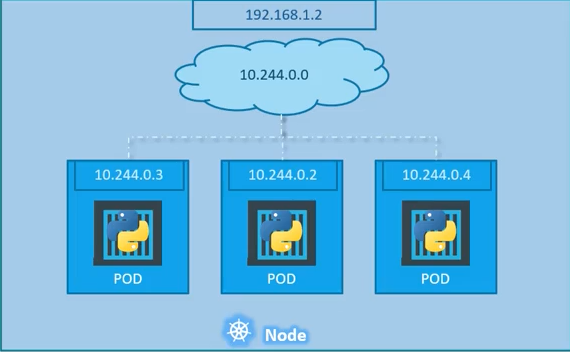
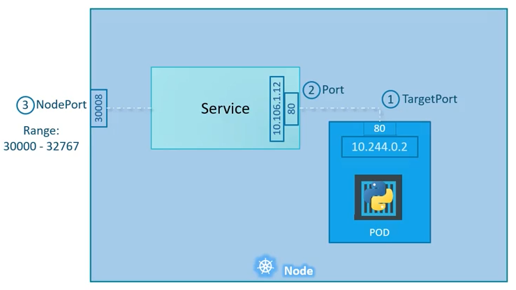
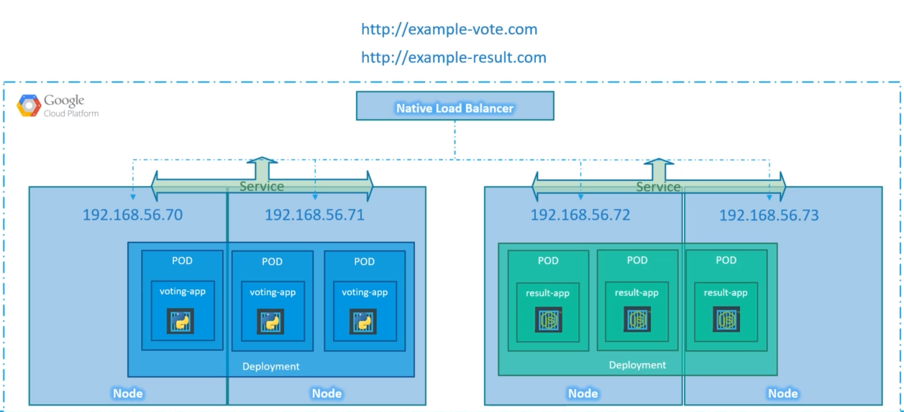

## K8S

#### Components https://kubernetes.io/docs/concepts/overview/components/

#### Installing MiniKube https://kubernetes.io/docs/setup/learning-environment/minikube/

- start and stop the cluster

  > minikube start

  > minikube stop

- cluster-info

  > kubectl cluster-info

- --help

  > kubectl create --help

- get all objects

  > kubectl get all

- get -o wide

  > kubectl get all -o wide

Retrieve more information

- create -f .

  > kubectl create -f .

Use all the definition from . directory to create kubernetes object(s)

- exec
  
  > kubectl exec -it foo-pod sh

Execute command against a Pod

- logs

  > kubectl logs pod/foo-pod

### Node

- get

  > kubectl get nodes

### Pod

A Pod encapsulates an application’s container (or, in some cases, multiple containers), storage resources, a unique network identity (IP address), as well as options that govern how the container(s) should run

pod-definition.yml

```yml
apiVersion: "v1"
kind: "Pod"
metadata:
  name: "foo-pod"
  labels: # Any Arbitrary key value pair
    app: "foo"
    type: "front-end"
spec:
  containers:
    - name: "redis"
      image: "redis:latest"
      ports:
        - containerPort: 80
      env:
    - name: DEMO_GREETING
      value: "Hello from the environment"
    - name: DEMO_FAREWELL
      value: "Such a sweet sorrow"
```

- create

  > kubectl create -f pod-definition.yml

* get

  > kubectl get pods

* describe

  > kubectl describe pod

  > kubectl describe pod foo-pod

* delete

  > kubectl delete pod redis

### ReplicationController and ReplicaSet

A ReplicaSet and ReplicationController is defined with fields, including a selector(selector is not required in replication controller) that specifies how to identify Pods it can acquire, a number of replicas indicating how many Pods it should be maintaining, and a pod template specifying the data of new Pods it should create to meet the number of replicas criteria. A ReplicaSet then fulfills its purpose by creating and deleting Pods as needed to reach the desired number. When a ReplicaSet needs to create new Pods, it uses its Pod **template**.

**replicationController-definition**.yml

```yml
apiVersion: "v1" # ReplicationController is the old one
kind: "ReplicationController"
metadata:
  name: "foo-rc"
  labels:
    app: "foo"
    type: "front-end"
spec:
  template:
    metadata:
      name: "foo-pod"
      labels:
        app: "foo"
        type: "front-end"
    spec:
      containers:
        - name: "redis"
          image: "redis:latest"
  replicas: 3
  selector: # Not required in ReplicationController
    matchLabels:
      type: "front-end"
```

**replicaSet-definition**.yml

```yml
apiVersion: "apps/v1"
kind: "ReplicaSet"
metadata:
  name: "foo-replicaset"
  labels:
    app: "foo"
    type: "front-end"
spec:
  template:
    metadata:
      name: "foo-pod"
      labels:
        app: "foo"
        type: "front-end"
    spec:
      containers:
        - name: "redis"
          image: "redis:latest"
  replicas: 3
  selector:
    matchLabels:
      type: "front-end"
```

- create

  > kubectl create -f rc-definition.yml

- get

  > kubectl get replicationController

  > kubectl get replicaset

- describe

  > kubectl describe replicaset

- delete

  > kubectl delete replicaset foo-replicaset

- run

  > kubectl run POD_NAME --image=POD_IMAGE

#### Scale replication

In order to change(increase/decrease) the number of replication consider one the following methods:

- Change the `replicas` field on rc-definition.yml then run:

  > kubectl replace rc-definition.yml

- scale

  > kubectl scale --replicas=6 -f rc-definition.yml

  > kubectl scale --replicas=6 replicaset foo-replicaSet

### Deployment

You describe a desired state in a Deployment, and the Deployment Controller changes the actual state to the desired state at a controlled rate. You can define Deployments to create new ReplicaSets, or to remove existing Deployments and adopt all their resources with new Deployments.

The following are typical use cases for Deployments:

- Create a Deployment to rollout a ReplicaSet. The ReplicaSet creates Pods in the background. Check the status of the rollout to see if it succeeds or not.
- Declare the new state of the Pods by updating the PodTemplateSpec of the Deployment. A new ReplicaSet is created and the Deployment manages moving the Pods from the old ReplicaSet to the new one at a controlled rate. Each new ReplicaSet updates the revision of the Deployment.
- Rollback to an earlier Deployment revision if the current state of the Deployment is not stable. Each rollback updates the revision of the Deployment.
- Scale up the Deployment to facilitate more load.
- Pause the Deployment to apply multiple fixes to its PodTemplateSpec and then resume it to start a new rollout.
- Use the status of the Deployment as an indicator that a rollout has stuck.
  Clean up older ReplicaSets that you don’t need anymore.

deployment-definition.yml

```yml
apiVersion: "apps/v1"
kind: "Deployment"
meta-data:
  name: "foo-deployment"
  labels:
    app: "foo"
    tier: "back-end"
spec:
  template:
    metadata:
      name: "foo"
      labels:
        app: "foo"
        tier: "back-end"
    spec:
      containers:
        - name: "express-server"
          image: "tajpouria/express-server:latest"
  replicas: 3
  selectors:
    matchLabels:
      app: "foo"
      tier: "back-end"
```

- create

  > kubectl create -f deployment-definition.yml --record

Consider to use `--record` flag to record CHANGE-CAUSE on revision history

- get

  > kubectl get deployments

- update

  > kubectl apply -f deployment-definition.yml --record

Consider to use `--record` flag to record CHANGE-CAUSE on revision history

> kubectl set image deployment/foo-deployment redis=redis:1.2.3

- restart

  > kubectl rollout restart deployment/foo-deployment

- status

  > kubectl rollout status deployment/foo-deployment

  > kubectl rollout history deployment/foo-deployment

- rollout

  > kubectl rollout undo deployment/foo-deployment

- describe

  > kubectl describe deployment foo-deployment

- delete

  > kubectl delete deployment foo-deployment

### Networking

Consider Node IP, internal private network IP and each Pod IP



### Service

#### type: NodePort

Make Internal Pod(s) accessible on an port on node **Only for development purposes**


service-definition.yml

```yml
apiVersion: "v1"
kind: "Service"
metadata:
  name: "foo-service"
spec:
  type: "NodePort"
  ports:
    - targetPort: 80
      port: 80
      nodePort: 30008 # Between 30000 up to 32767
  selector:
    app: "foo-app"
    type: "back-end"
```

- create

  > kubectl create -f service-definition.yml

#### type: ClusterIP

Allow every other object **inside** the cluster to access the object that clusterIP pointing at

```yml
apiVersion: "v1"
kind: "Service"
metadata:
  name: "foo-service"
spec:
  type: "ClusterIP" # Default type value is ClusterIP
  ports:
    - targetPort: 80
      port: 80
  selector:
    app: "foo"
    type: "back-end"
```

- create

  > kubectl create -f service-definition.yml

#### type: LoadBalancer

Handle load balancing between different Node and Pods on supported platform like GoogleCloudPlatform



```yml
apiVersion: "v1"
kind: "Service"
metadata:
  name: "foo-service"
spec:
  type: "LoadBalancer"
  ports:
    - targetPort: 3000
      port: 80
  selector:
    app: "foo"
    type: "front-end"
```
